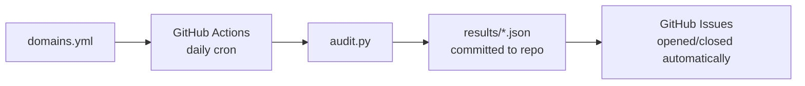

# dns-auditer

Automated daily DNS security audits via GitHub Actions. Fork this repo, add your domains, and get GitHub Issues when something breaks.

## How it works



1. A scheduled workflow runs every day at 07:00 UTC
2. Each domain in `domains.yml` gets a full security audit
3. Results are committed to `results/<domain>.json` — a running history of your security posture
4. If a check fails or degrades, a GitHub Issue is opened with details
5. When a check passes again, the issue is closed automatically

## Quick start

1. **Fork this repo**
2. **Edit `domains.yml`**:

```yaml
domains:
  - yourdomain.com
```

3. **Push** — the workflow triggers on changes to `domains.yml`
4. **Check Issues** — any failing checks appear as issues

## What's checked

### Email

| Check | What it verifies | Severity |
|-------|-----------------|----------|
| **SPF** | Valid SPF record, DNS lookup count within limits | fail |
| **DMARC** | Valid DMARC record, policy is not `none` | fail/warn |
| **DKIM** | DKIM records exist and are valid (auto-detected) | fail |
| **DNSSEC** | DNSSEC is enabled | warn |
| **MX** | MX records exist and resolve | warn |

### TLS

| Check | What it verifies | Severity |
|-------|-----------------|----------|
| **TLS Certificate** | Valid cert, not expiring within 30 days | fail (<7d) / warn (<30d) |
| **TLS Protocol** | Not using deprecated SSLv3, TLS 1.0, or TLS 1.1 | fail |
| **TLS Cipher** | No weak cipher suites (RC4, 3DES, export, null) | warn |
| **Certificate Coverage** | Certificate SANs cover the domain and www | fail/warn |
| **Certificate Transparency** | Certificate appears in public CT logs (via crt.sh) | fail/warn |
| **CAA** | CAA records restrict which CAs can issue certs | warn |

### Web Security

| Check | What it verifies | Severity |
|-------|-----------------|----------|
| **HTTPS Redirect** | HTTP redirects to HTTPS | fail |
| **HSTS** | Strict-Transport-Security header present | warn |
| **CSP** | Content-Security-Policy header present | warn |
| **X-Frame-Options** | Clickjacking protection header | warn |
| **X-Content-Type-Options** | MIME sniffing protection | warn |
| **Permissions-Policy** | Browser feature restrictions | warn |

### DNS Hygiene

| Check | What it verifies | Severity |
|-------|-----------------|----------|
| **NS Health** | All nameservers responding | warn |
| **SOA Consistency** | SOA serial matches across all nameservers | warn |
| **Dangling CNAME** | www CNAME target resolves (subdomain takeover risk) | fail |

## Per-domain configuration

You can customise which checks run (and at what severity) per domain using the extended `domains.yml` format:

```yaml
domains:
  - simple-domain.com              # all checks, default severities

  - legacy-site.com:               # extended format
      skip_checks: [dnssec, permissions_policy]
      severity_overrides:
        caa: pass                  # accepted risk, don't alert
        hsts: warn                 # downgrade to warning
      expected_subdomains: [www, api, mail]
```

| Key | Description |
|-----|-------------|
| `skip_checks` | List of check names to skip entirely. Existing issues are closed. |
| `severity_overrides` | Override a check's status (`pass`, `warn`, `fail`). Original status is preserved in JSON as `original_status`. |
| `expected_subdomains` | Subdomains the TLS certificate should cover (checked via SANs). |

Both formats can be mixed in the same file. The simple string format is fully backward compatible.

## Requirements

- A GitHub repository (fork this one)
- GitHub Actions enabled (free for public repos)
- No secrets or API keys required

## Local development

```bash
uv run scripts/audit.py
```

## Project structure

```
scripts/
├── audit.py              # CLI entrypoint and orchestration
├── config.py             # domains.yml parser (simple + extended format)
├── checks/
│   ├── email.py          # SPF, DMARC, DNSSEC, MX
│   ├── tls.py            # certificate, protocol, cipher, coverage, CT, CAA
│   ├── web.py            # HTTPS redirect, HSTS, security headers
│   └── dns.py            # NS health, SOA consistency, dangling CNAMEs
└── manage_issues.py      # GitHub Issue lifecycle management
```

## Contributing

PRs welcome.

## License

MIT

---

Built by [Gantry](https://gantryops.dev), a platform engineering practice.
Need help with your infrastructure? [Start with an audit.](https://gantryops.dev/#pricing)
