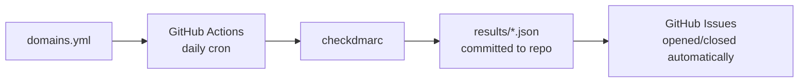

# dns-auditer

Automated daily DNS security audits via GitHub Actions. Fork this repo, add your domains, and get GitHub Issues when something breaks.

## How it works



1. A scheduled workflow runs every day at 07:00 UTC
2. Each domain in `domains.yml` gets a full security audit
3. Results are committed to `results/<domain>.json` — a running history of your security posture
4. If a check fails or degrades, a GitHub Issue is opened with details
5. When a check passes again, the issue is closed automatically

## Quick start

1. **Fork this repo**
2. **Edit `domains.yml`**:

```yaml
domains:
  - yourdomain.com
```

3. **Push** — the workflow triggers on changes to `domains.yml`
4. **Check Issues** — any failing checks appear as issues

## What's checked

| Check | What it verifies | Severity |
|-------|-----------------|----------|
| **SPF** | Valid SPF record, DNS lookup count within limits | fail |
| **DMARC** | Valid DMARC record, policy is not `none` | fail/warn |
| **DKIM** | DKIM records exist and are valid (auto-detected) | fail |
| **DNSSEC** | DNSSEC is enabled | warn |
| **MX** | MX records exist and resolve | warn |

## Requirements

- A GitHub repository (fork this one)
- GitHub Actions enabled (free for public repos)
- No secrets or API keys required

## Local development

```bash
uv run scripts/audit.py
```

## Contributing

PRs welcome.

## License

MIT

---

Built by [Gantry](https://gantryops.dev), a platform engineering practice.
Need help with your infrastructure? [Start with an audit.](https://gantryops.dev/#pricing)
